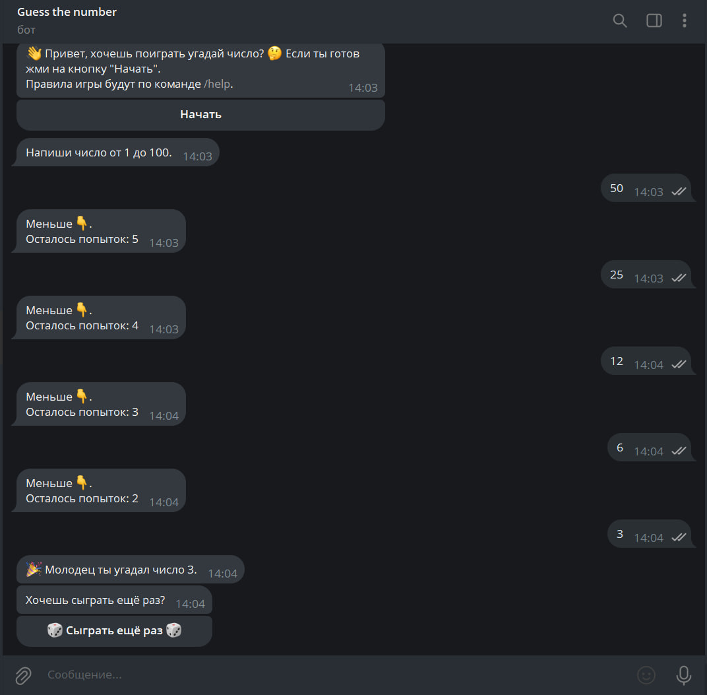

# 🎲 Telegram Game Bot

Бот на Python, в котором ты должен угадать число от 1 до 100 за ограниченное количество попыток!

## 📌 Функции
- Загадка случайного числа.
- Подсказки "больше" или "меньше".
- Ограниченное количество попыток.
- Кнопка «Сыграть ещё раз».

## 📷 Превью


## 🚀 Запуск бота

### 1. Клонируй репозиторий
```bash
git clone https://github.com/твоя-ссылка/game-bot.git
cd game-bot
